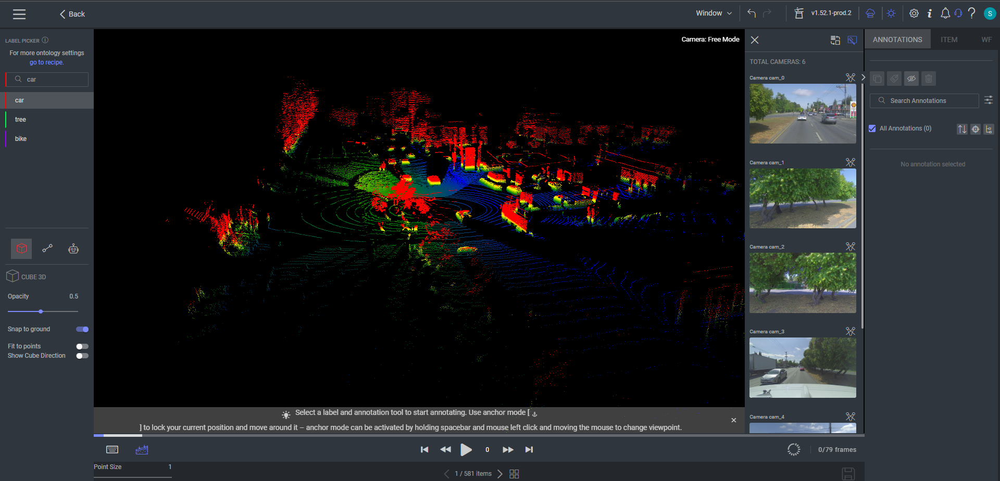

# Dataloop LiDAR SDK

<p align="center">
  
</p>

---

<p align="center">
  <a href="https://dataloop.ai/solutions/lidar-annotation-platform/"> </a>
</p>

[](https://github.com/dataloop-ai/dtlpy)

---

## Installation and usage

To install the package, run the following command:

```commandline
pip install git+https://github.com/dataloop-ai-apps/dtlpy-lidar.git
```

to use the package, run the following import:

```python
import dtlpylidar
```

And now you are ready to use the package!

---

## Quick Start

After setting up the data as described in
the [LiDAR Data Setup](https://docs.dataloop.ai/docs/lidar-data-setup) documentation, you can run the
following script to create the LiDAR video file.
Run the following script to create the LiDAR video file.

```python
import dtlpy as dl
from dtlpylidar.parsers.base_parser import LidarFileMappingParser

dataset = dl.datasets.get(dataset_id="<dataset id>")
mapping_item = dataset.items.get(item_id="<mapping.json item id>")
frames_item = LidarFileMappingParser().parse_data(mapping_item=mapping_item)
frames_item.open_in_web()
```

---

## Local Visualization (using Open3D)

To visualize locally a frame from the LiDAR video file on the remote dataset, you can use the following code snippet:

```python
import dtlpy as dl
from dtlpylidar.utilities.visualizations.visualize_scene import visualize_in_open_3d

dataset = dl.datasets.get(dataset_id="<dataset id>")
frames_item = dataset.items.get(item_id="<frames.json item id>")

frame_num = 0  # frame number to visualize
dark_mode = True  # dark/light mode visualization
rgb_points_color = True  # (If the point cloud has RGB points) color the points with the RGB values

visualize_in_open_3d(frames_item=frames_item, frame_num=frame_num, dark_mode=dark_mode, 
                     rgb_points_color=rgb_points_color)
```

---

## Description

The Dataloop LiDAR SDK application includes all the pre-processing and utilities for working with 
LiDAR data on the Dataloop platform.

**Pre-processing:**

* [Dataloop Base Parser](dtlpylidar/parsers/PARSERS_README.md) - The base parser to create a LiDAR video file, from a `mapping.json` file.
* [Custom Base Parser](dtlpylidar/parsers/custom_base_parser.py) - The custom parser to create a LiDAR video file, from any directory structure of a LiDAR scene.


**Utilities:**

* [3D Transformations](dtlpylidar/utilities/transformations/transformations.py) - Utility functions to perform 3D transformations on LiDAR calibration data.
* [Open3D Visualizations](dtlpylidar/utilities/visualizations/visualize_scene.py) - Visualize locally in Open3D a frame from the remote LiDAR video file.

---

## Contributors

## Contributions, Bugs and Issues - How to Contribute

We welcome anyone to help us improve this app.  
[Here's](CONTRIBUTING.md) a detailed instructions to help you open a bug or ask for a feature request
