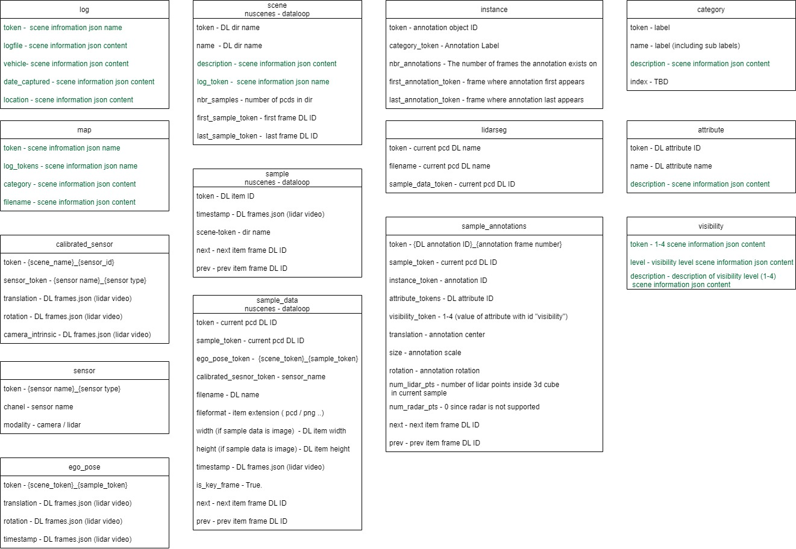
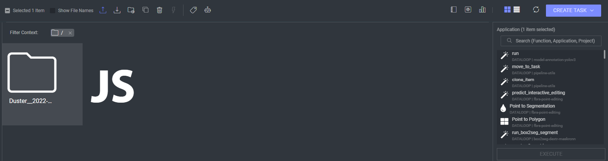

# Dataloop to nuScenes Converter

--- 

## Description
Nuscenes data format is a format that follows a database schema. All annotations and meta data (including calibration, maps, vehicle coordinates etc.) are covered in a relational database.

Link to the [nuScenes data format](https://www.nuscenes.org/nuscenes#data-format) that the converter is supposed to follow.

The Dataloop to nuScenes converter, takes a lidar scene from dataloop and exports a json file per table in the nuScenes database schema.

### nuScenes mapping on dataloop:


### Lidar scenes includes:
A folder including the following information is considered a lidar scene: 
- A folder including images and calibration file per camera.
- A Folder including PCD files and lidar sensor calibrations.
- Lidar case (the lidar video).
- scenes information file for log, descriptions etc. (optional).

### scenes information json file

the scenes information json that includes data only relevant to the nuScenes data format, the file includes descriptions
about the scene, attributes, etc.
it also includes information about the scenes itself, where it was taken, date the scene was capture.

File template: 

```json
{
    "log": {
        "logfile": "logfile",
        "vehicle": "vehicle",
        "date_captured": "date_captured",
        "location": "Location"
    },
    "labels description": {
        "label 1": "label 1 description",
        "label 2": "label 2 description"
    },
    "attributes description": {
        "attribute 1 ID": "attribute 1 description",
        "attribute 2 ID": "attribute 2 description"
    },
    "scene description": "description",
    "map": {
        "category": "category",
        "filename": "filename"
    },
    "visibility": {
        "1": {
            "level": "v0-40",
            "description": "visibility of whole object is between 0 and 40%"
        },
        "2": {
            "level": "v40-60",
            "description": "visibility of whole object is between 40 and 60%"
        },
        "3": {
            "level": "v60-80",
            "description": "visibility of whole object is between 60 and 80%"
        },
        "4": {
            "level": "v80-100",
            "description": "visibility of whole object is between 80 and 100%"
        }
    }
}

```
### Running nuScenes converter:

once the app is installed, each dataset will have application slots on the platform that will export the data in nuScenes format

The application can be run in two ways:

- Running on entire dataset
  - activated without any selected filters or directories.


- Running on a single scene
  - select a single / multiple scene folders and activate run the app.
  - Can also be run using the application sidebar in the data-browser.



once the execution is complete:
- a zip file composed of all the json files will be uploaded to the dataset and downloaded.

### Running tests:

`python -m unittest`


