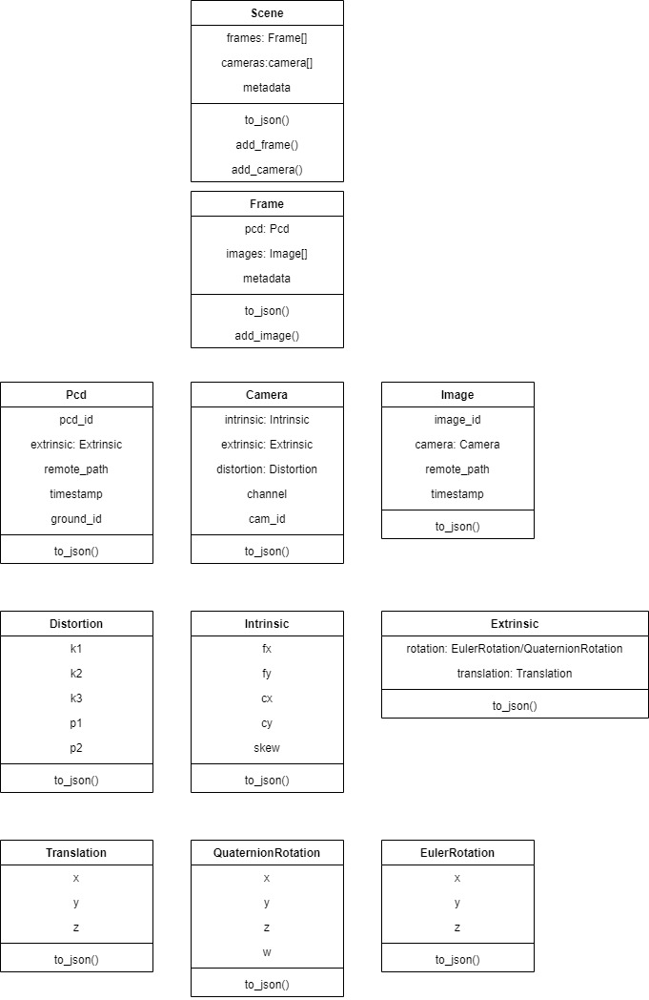
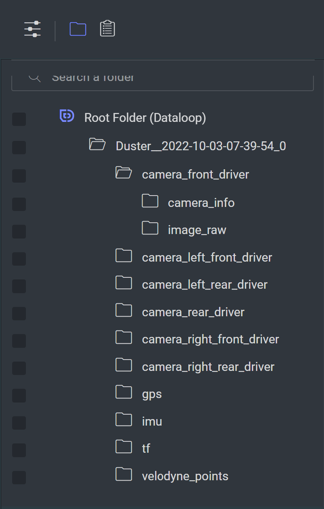
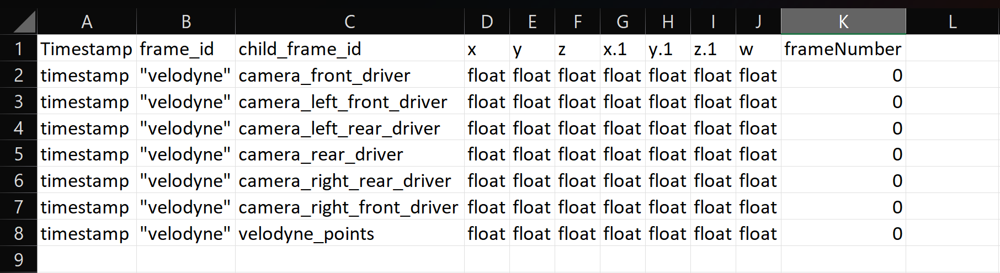

# nuScenes to Dataloop data parser

---

## Description:

### Lidar base: 
Includes all the classes needed in order to create a lidar video (frames.json)

Class Diagram:

## Lidar data parsers:
Scripts that gather data from a dataloop dataset in order to build a lidar video using the base converter.
The script will follow pre-defined data structures:

## nuScenes data structure:
Each directory is considered a scene if it contains the following:
- Folder per camera, where each camera folder contains:
  - Camera_info : includes  json files with intrinsic calibrations for each frame.
  - Image_raw: includes an image per frame for this specific camera
- Folder for lidar (velodyne_points):
  - Includes .pcd files.
- Folder (tf) for extrinsic calibrations:
  - Includes a csv file with all the sensors extrinsic calibrations.

Frame order definition: 
For each item inside the folder mentioned above, the order they will appear in will be decided by the frame number (Integer)) included in the file name.	
Supported convention example:
- `{AnyString}_{FrameNum}.pcd`
- `{AnyString}_{FrameNum}.png`

The order the images will appear in each frame is defined as the order in the CSV file.

### CSV Explanation 

Data will only be extracted from rows where frame_id is “velodyne”
Child_frame_id needs to be the folder name for the specific sensor (‘velodyne_points’) for lidar sensor.
Frame number(col K) is the number of frames for the specific where the translation 
x, y, z (cols D,E,F) and rotation x.1, y.1, z.1, w (cols G,H,I,J) are relevant.
If the values are not found the calibrations will be set to default values (vectors of 0).
Order of the columns and additional columns will not affect the end result,since the filtering is by col name.

